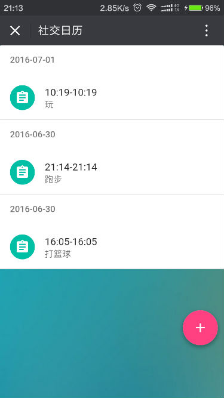
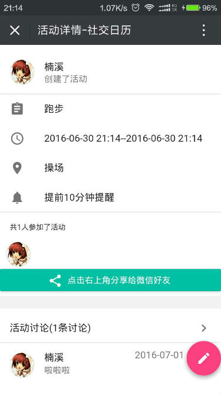
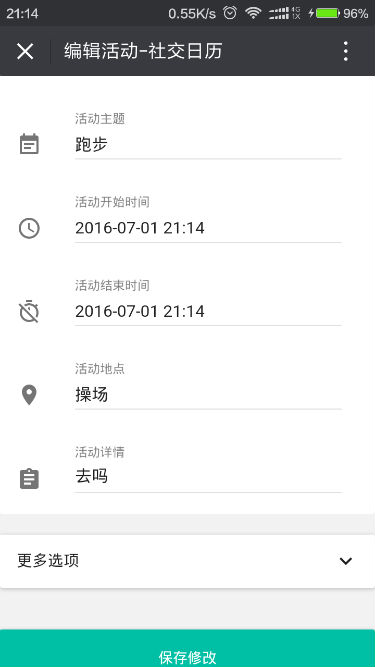

#社交日历开发配置

##效果展示
首页<br/>
<br/>
添加活动<br/>
<br/>
活动详情<br/>
<br/>
编辑活动<br/>
<br/>
活动讨论<br/>
<br/>
##clone项目到本地
1.安装git<br/>
2.初始化配置

```sh
git config --global user.name "your github's name"
git config --global user.email "your github's email"
```
3.打开Git Bash命令窗口(如果安装了git，鼠标右键就可以找到Git Bash Here)

```sh
	git clone https://github.com/social-calendar/social-calendar.git
```
4.克隆完之后，在本地创建dev分支

```sh
	git checkout -b dev origin/dev
```
5.为确保是在dev分之下修改，每次提交修改前执行

```sh
	git checkout dev
```
##将修改同步到github
1.提交修改

```sh
    git add -A
	git commit -m "提交说明"
```
2.获取远程更改
```sh
	git fetch
```
3.本地和远程更改合并
```sh
	git pull origin dev
```
4.上传到github
```sh
	git push origin dev	
```

##前端环境配置
1.下载安装nodejs
[nodejs下载地址](https://nodejs.org/)

##运行前端代码
1.安装项目依赖
在项目根目录下打开终端或者命令窗口，运行命令 
```sh
	npm install
```
2.生成静态文件

```sh
npm run build
```
